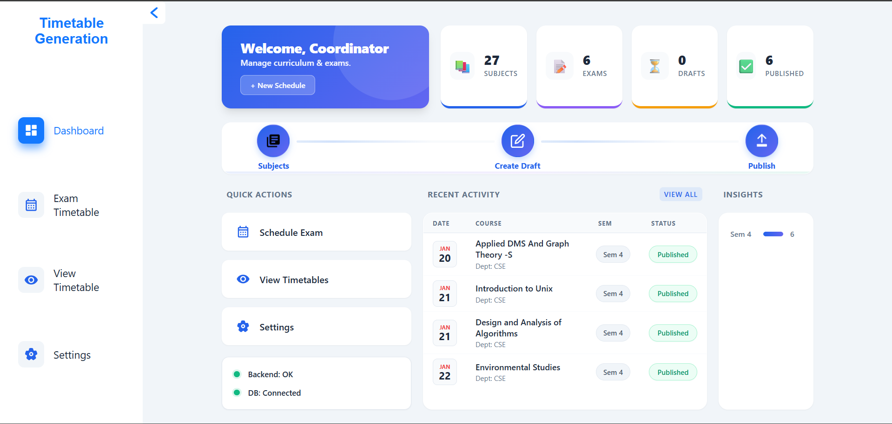
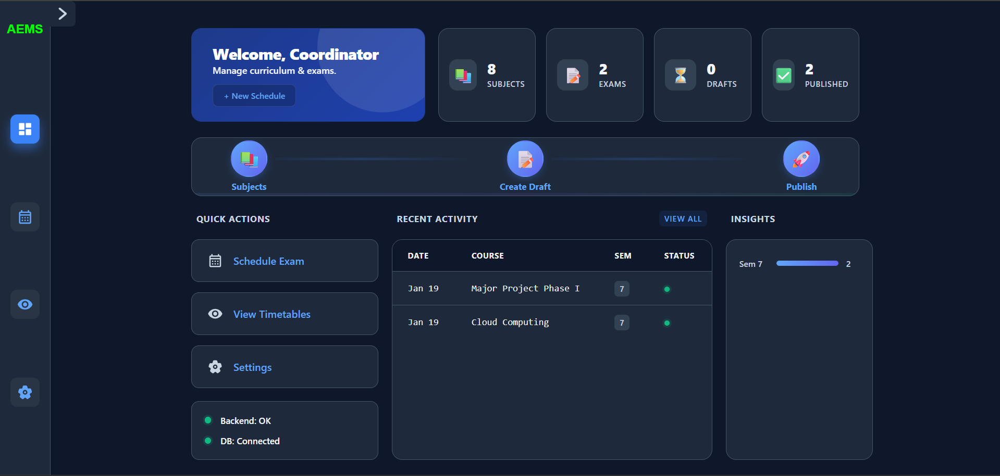
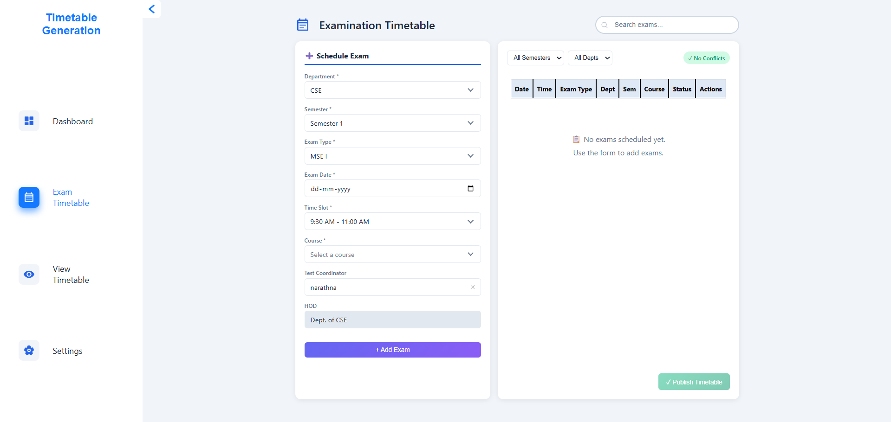
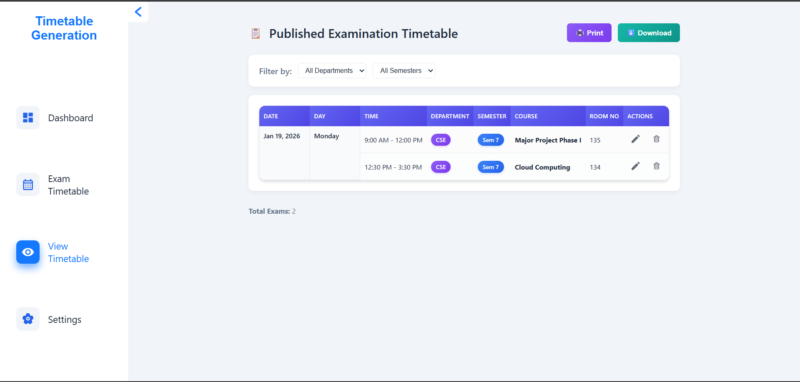
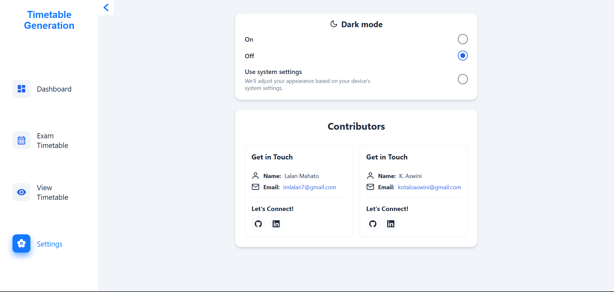
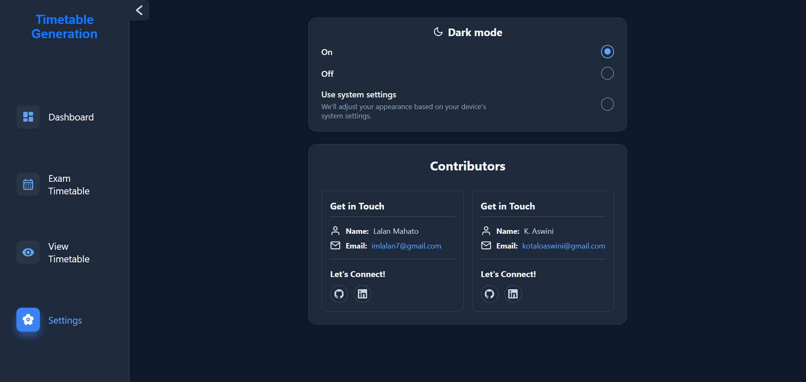

# Timetable Generation System

A full-stack application for managing and generating examination timetables.

## Dashboard Preview

### Light Mode


### Dark Mode


## Exam Timetable Preview



## Published Timetable Preview



## Settings & Contributors Preview

### Light Mode


### Dark Mode


## Features

Key capabilities of the system:

*   **Simple Dashboard**: A main control panel to manage everything in one place.
*   **Step-by-Step Workflow**: Easy-to-follow process for scheduling:
    1.  **Subjects**: Add and organize your subjects.
    2.  **Draft**: Generate and refine exam schedules.
    3.  **Publish**: Share the final timetable.
*   **At-a-Glance Stats**: Quickly see:
    *   How many subjects you have.
    *   Number of exams scheduled.
    *   Drafts you are working on.
    *   Timetables that are live.
*   **Fast Actions**: Shortcuts to:
    *   Schedule a new exam.
    *   See existing timetables.
    *   Change settings.
*   **Recent Activity**: Keep track of the latest updates and changes.
*   **System Health**: Instantly check if the server and database are connected.
*   **Database**: Uses MongoDB for reliable data storage.

## Tech Stack

*   **Frontend**: React 19, TypeScript, Vite
*   **Backend**: Java 21, Spring Boot 3
*   **Database**: MongoDB (running on Docker)
*   **Key Tools**: Maven, jsPDF (for PDFs), SheetJS (for Excel), EmailJS

## Getting Started

### Prerequisites

*   Node.js (for Frontend)
*   Java 21 (for Backend)
*   Docker (for Database)

### Installation & Running

1.  **Database**:
    Start MongoDB using Docker:
    ```bash
    docker-compose up -d
    ```

2.  **Backend**:
    Navigate to the backend folder and run the application:
    ```bash
    cd backend
    ./mvnw spring-boot:run
    ```

3.  **Frontend**:
    Navigate to the frontend folder, install dependencies, and start the server:
    ```bash
    cd frontend
    npm install
    npm run dev
    ```
