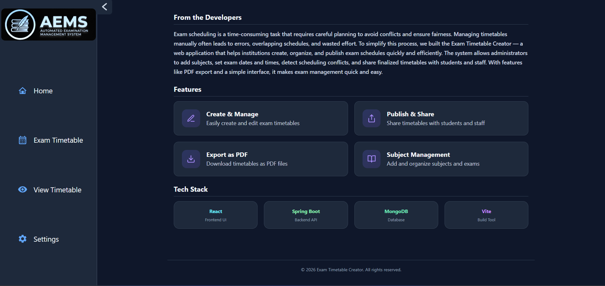

# Timetable Generation System

A simple tool to create, manage, and share exam timetables for schools and colleges.

## Tech Stack
- **Frontend**: React, JavaScript, Vite
- **Backend**: Spring Boot, Java 21
- **Database**: MongoDB 
## Quick Start
1. **Start MongoDB** 

2. **Start Backend**
   ```bash
   cd backend
   ./mvnw spring-boot:run
   ```

3. **Start Frontend**
   ```bash
   cd frontend
   npm install
   npm run dev
   ```

## Database Configuration

- **Local (Default)**: http://localhost:5173/


## Screenshots

### Dashboard
| Light Mode | Dark Mode |
| --- | --- |
|  |  |

### Exam Timetable


### Published Timetable


### Settings
| Light Mode | Dark Mode |
| --- | --- |
|  |  |

### About Us


### Print Format


