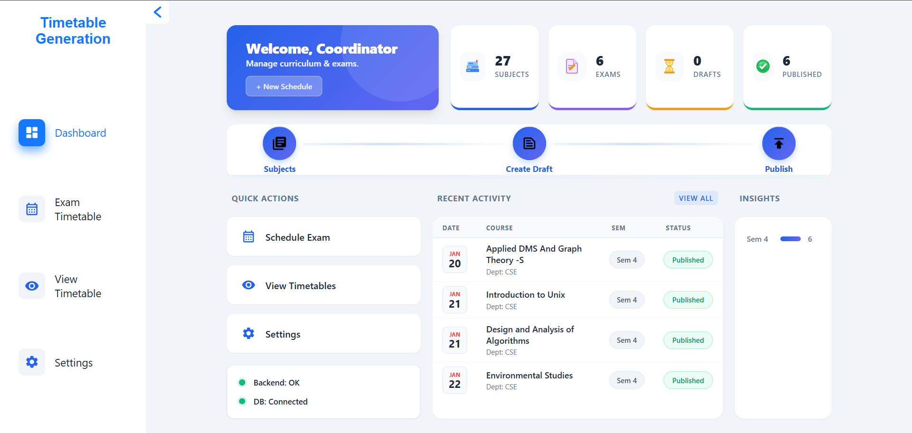
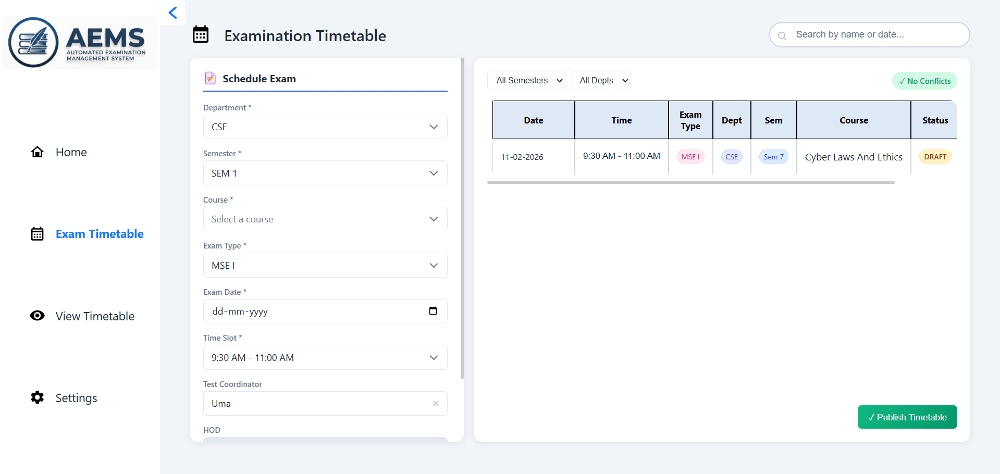
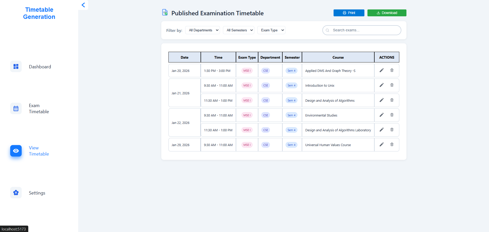
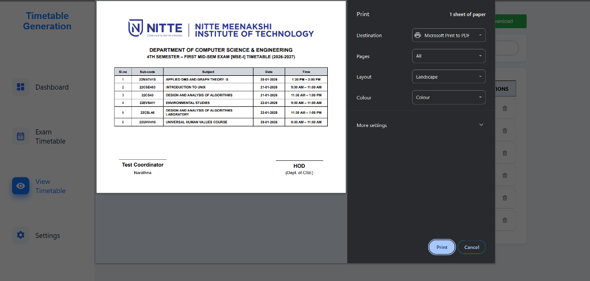

<<<<<<< HEAD
=======

>>>>>>> aa3dde3a355e5ae820d12b7242436f4d3dda3c1c
Follow these steps to set up the project locally.

### Prerequisites
- **Node.js**: v18 or higher
- **Java**: JDK 21
- **MongoDB**: Running locally or via Atlas

### 1. Database Setup
<<<<<<< HEAD
Ensure your local MongoDB instance is running.
=======
Ensure your local MongoDB instance is running. 
>>>>>>> aa3dde3a355e5ae820d12b7242436f4d3dda3c1c

### 2. Backend Setup
Navigate to the backend directory and start the Spring Boot application.

```bash
cd backend
# Run using Maven wrapper
./mvnw spring-boot:run
```
*The backend server will start at `http://localhost:8080`*

### 3. Frontend Setup
Navigate to the frontend directory, install dependencies, and start the development server.

```bash
cd frontend
# Install dependencies
npm install
# Start the dev server
npm run dev
```
*The frontend application will run at `http://localhost:5173`*

## 📸 Screenshots

### Dashboard
| Light Mode | Dark Mode |
| --- | --- |
|  |  |

### Exam Timetable Management


### Published Timetable View


### User Profile


### Settings & Customization
| Light Mode | Dark Mode |
| --- | --- |
|  |  |

### Print Preview



## 🤝 Contributing

Contributions are welcome! Please feel free to submit a Pull Request.

