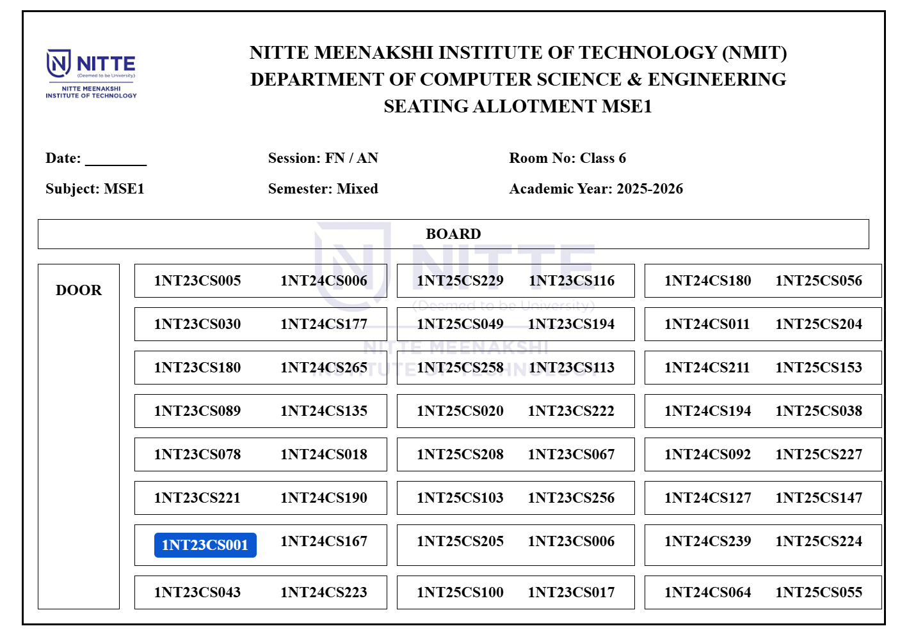
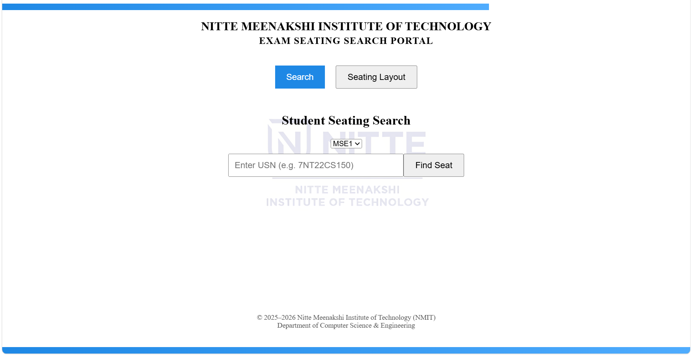
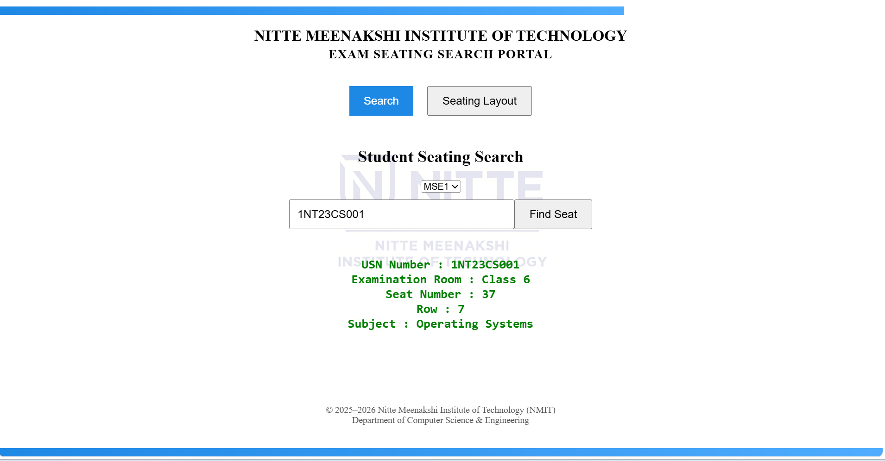

# Automated Examination Seating System

### Developed as part of internship project
## 📌 Project Overview

This project is a Full Stack Web Application developed to automate the allocation of examination seating for students. It ensures fair and systematic distribution of students across classrooms and labs.

---

## 🛠️ Technologies Used

* Frontend: React.js
* Backend: Spring Boot (Java)
* Database: MySQL

---

## ⚙️ Features

* Automatic seating allocation
* Mixed student arrangement (multiple batches)
* Search student seat by USN
* Classroom and lab allocation
* Clean printable seating layout

---

## 📸 Output Screenshots

### 🪑 Seating Arrangement



### 🔍 Search Result



### 🔎 Search by USN



---

## 🗄️ Database Setup (IMPORTANT)

* Make sure MySQL Workbench is running
* Run:

  ```
  database/database.sql
  ```
* Ensure backend is connected to database

---

## ▶️ How to Run

### Backend (Spring Boot)

```
cd D:\demo
.\mvnw spring-boot:run
```

### Frontend (React)

```
cd frontend_m2
npm install
npm start
```

👉 Browser opens at:

```
http://localhost:3000
```

---

## 📊 Exam Mapping Logic

* 1NT23 series → Operating System (OS)
* 1NT24 series → Data Structures (DSA)
* 1NT25 series → Cyber Security

---

## ⚠️ Important Notes

* Backend must be running before frontend
* MySQL Workbench must be active
* Database should be initialized before execution

---

## 📂 Project Structure

* backend_m2 → Backend logic
* frontend_m2 → UI
* database → SQL file
* screenshots → Output images

---

## 📌 Conclusion

This system automates seating allocation efficiently and reduces manual errors during examination management.
